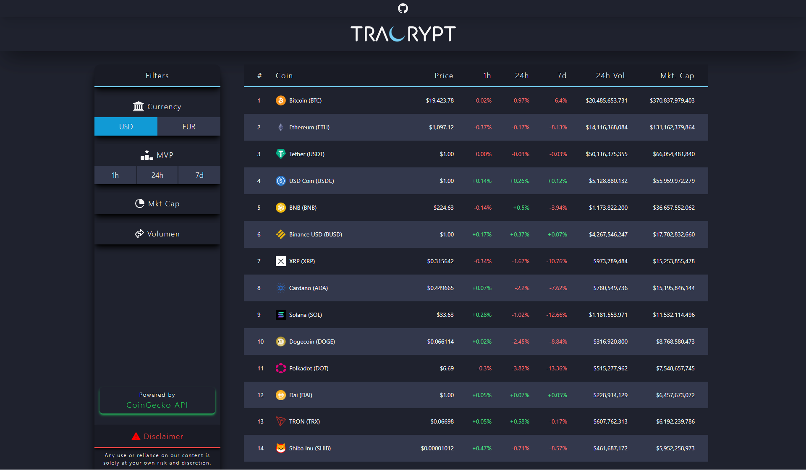
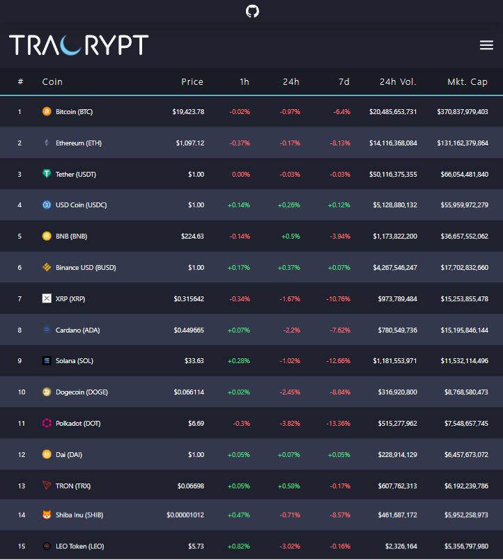
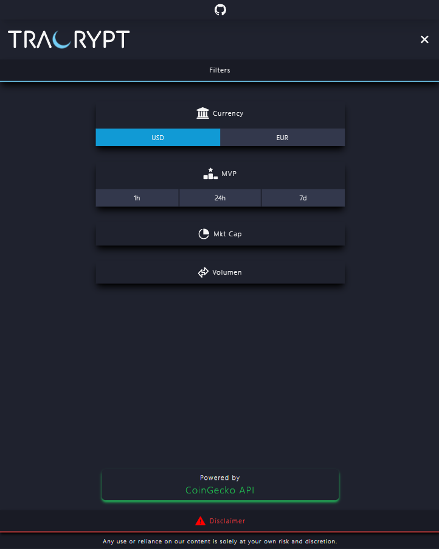
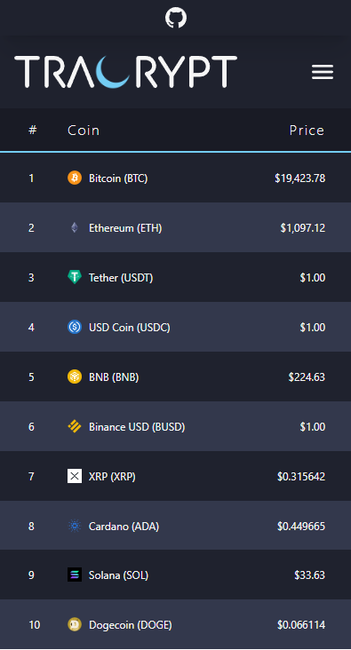
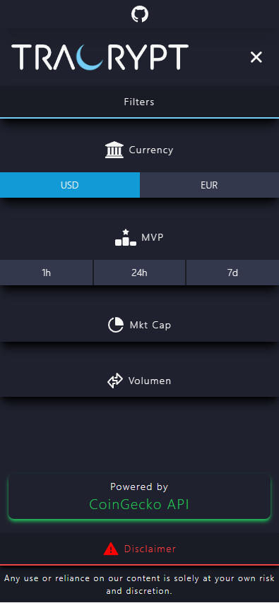

<div align="center">
  <a href="https://tracrypt.sebastianlacoste.com" target="_blank" rel="noopener noreferrer">
    
  </a>
</div>

---

> [Tracrypt](https://tracrypt.sebastianlacoste.com) is a web-based tool where you can track and filter market data from the top 250 cryptocurrencies, all data is obtained via the CoinGecko API.

## Features

- **Available Data**

  - USD/EUR

    - Price

    - Volume

    - Market Capitalization

- **Higher/Lower Filters**

  - Price change

    - 1h

    - 24h

    - 7d

  - Volume 24h

  - Market Capitalization

- **PWA Support**

- **Mobile-Friendly**

## Tech Stack

- **Front-end**

  - **Build**

    - [Vite](https://github.com/vitejs/vite)

  - **HTML/JS**

    - [React](https://github.com/facebook/react)

    - [React Router](https://github.com/remix-run/react-router)

  - **CSS**

    - [Tailwind CSS](https://github.com/tailwindlabs/tailwindcss)

    - [Prettier plugin for Tailwind CSS](https://github.com/tailwindlabs/prettier-plugin-tailwindcss)

    - [PostCSS](https://github.com/postcss/postcss)

    - [Autoprefixer](https://github.com/postcss/autoprefixer)

  - **HTTP-Client**

    - [Axios](https://github.com/axios/axios)

- **Back-end**

  - **API**

    - [CoinGecko API](https://www.coingecko.com/en/api)

## Run Locally

Install required

- [Node.js/npm](https://nodejs.org/en/download)

Clone the repository

- HTTPS

  ```bash
  git clone https://github.com/sebastianlacoste/tracrypt.git
  ```

- SSH

  ```bash
  git clone git@github.com:sebastianlacoste/tracrypt.git
  ```

Go to the repository directory

```bash
  cd tracrypt/
```

Install dev/Dependencies

```bash
  npm i
```

Start the server

```bash
  npm run dev
```

In the browser, go to

```
  http://localhost:3000
```

**All-In-One**

- HTTPS

  ```bash
  git clone https://github.com/sebastianlacoste/tracrypt.git; cd tracrypt/; npm i; npm run dev;
  ```

- SSH

  ```bash
  git clone git@github.com:sebastianlacoste/tracrypt.git; cd tracrypt/; npm i; npm run dev;
  ```

## Screenshots

- **Desktop**

  

- **Tablet**

  

  

- **Mobile**

  

  

## License

- [MIT](./LICENSE)
